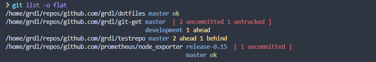
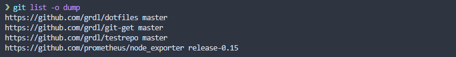

# git-get

[](https://github.com/grdl/git-get/actions)
[](https://goreportcard.com/report/github.com/grdl/git-get)
[](https://github.com/grdl/git-get/releases/latest)
[](https://github.com/grdl/git-get/blob/master/go.mod)
[](LICENSE.md)

A tool to clone, organize, and manage multiple Git repositories with an automatic directory structure based on repository URLs.

## Table of Contents

- [Overview](#overview)
- [Features](#features)
- [Prerequisites](#prerequisites)
- [Installation](#installation)
  - [macOS](#macos)
  - [Linux](#linux)
  - [Windows](#windows)
  - [Building from Source](#building-from-source)
- [Quick Start](#quick-start)
- [Usage](#usage)
  - [git get](#git-get)
  - [git list](#git-list)
  - [Batch Operations](#batch-operations)
- [Configuration](#configuration)
  - [Environment Variables](#environment-variables)
  - [Git Configuration](#git-configuration)
- [Examples](#examples)
- [Testing](#testing)
- [Troubleshooting](#troubleshooting)
- [Contributing](#contributing)
- [License](#license)
- [Acknowledgments](#acknowledgments)

## Overview

**git-get** solves the problem of manually organizing multiple Git repositories. Instead of scattered clones in random directories, it creates a clean, predictable directory structure based on repository URLs, similar to Go's `go get` command.

It provides two commands:
- **`git get`** - Clones repositories into an organized directory tree
- **`git list`** - Shows the status of all your repositories at a glance


## Features

- **Automatic organization** - Creates directory structure based on repository URL
- **Git integration** - Seamlessly integrates as native Git commands
- **Multi-platform** - Works on macOS, Linux, and Windows
- **Repository discovery** - Lists all repositories with their status
- **Flexible configuration** - Supports environment variables and Git config
- **Multiple output formats** - Tree, flat, and dump formats for different use cases
- **Dotfiles friendly** - Clone multiple repositories from a list kept in dotfiles

## Prerequisites

- Git 2.0+ installed and configured
- Go 1.19+ (only if building from source)

## Installation

### macOS

```bash
brew install grdl/tap/git-get
```

### Linux

**Option 1: Package managers**
```bash
# Download .deb or .rpm from releases
wget https://github.com/grdl/git-get/releases/latest/download/git-get_linux_amd64.deb
sudo dpkg -i git-get_linux_amd64.deb
```

**Option 2: Homebrew on Linux**
```bash
brew install grdl/tap/git-get
```

### Windows

**Option 1: Download binary**
1. Download the latest `.zip` file from [releases](https://github.com/grdl/git-get/releases/latest)
2. Extract the binaries to a directory in your PATH

**Option 2: Using Scoop**
```powershell
scoop bucket add git-get https://github.com/grdl/git-get
scoop install git-get
```

### Building from Source

```bash
git clone https://github.com/grdl/git-get.git
cd git-get
go build -o bin/ ./cmd/...
```

Then add the `bin/` directory to your PATH.

## Quick Start

1. **Install git-get** using one of the methods above
2. **Clone your first repository**:
   ```bash
   git get github.com/grdl/git-get
   ```
3. **List your repositories**:
   ```bash
   git list
   ```

That's it! Your repository is now organized in `~/repositories/github.com/grdl/git-get/`.

## Usage

### git get

Clone repositories with automatic directory structure:

```bash
git get <REPOSITORY> [flags]
```

**Flags:**
- `-b, --branch <name>` - Branch or tag to checkout after cloning
- `-d, --dump <file>` - Clone multiple repositories from a dump file
- `-t, --host <host>` - Default host for short repository names (default: github.com)
- `-r, --root <path>` - Root directory for repositories (default: ~/repositories)
- `-c, --scheme <scheme>` - Default scheme for URLs (default: ssh)
- `-s, --skip-host` - Skip creating host directory
- `-h, --help` - Show help
- `-v, --version` - Show version

**Repository formats:**
- Full URL: `https://github.com/user/repo.git`
- SSH URL: `git@github.com:user/repo.git`
- Short format: `user/repo` (uses default host)
- GitHub format: `github.com/user/repo`

### git list

Display repository status with multiple output formats:

```bash
git list [flags]
```

**Flags:**
- `-f, --fetch` - Fetch from remotes before listing
- `-o, --out <format>` - Output format: tree, flat, or dump (default: tree)
- `-r, --root <path>` - Root directory to scan (default: ~/repositories)
- `-h, --help` - Show help
- `-v, --version` - Show version

**Output formats:**

**Tree format (default):**


**Flat format:**


**Dump format:**


### Batch Operations

Generate dump file from existing repositories:
```bash
git list --out dump > my-repos.txt
```

Clone all repositories from the dump file:

```bash
git get --dump repos.txt
```

## Configuration

All configuration options that can be set via command-line flags, can also be set by environment variables, or Git configuration files.

**Priority order** (highest to lowest):
1. Command-line flags
2. Environment variables
3. Git configuration file
4. Default values

### Environment Variables

Use the `GITGET_` prefix with uppercase flag names:

```bash
export GITGET_ROOT=/workspace/repositories
export GITGET_HOST=gitlab.com
export GITGET_SKIP_HOST=true
```

### Git Configuration

Add a `[gitget]` section to your global Git configuration:

```bash
git config --global gitget.root /workspace/repositories
git config --global gitget.host gitlab.com
git config --global gitget.skip-host true
```

Or edit `~/.gitconfig` directly:
```ini
[gitget]
    root = /workspace/repositories
    host = gitlab.com
    skip-host = true
```

## Examples

**Clone a repository:**
```bash
git get facebook/react
# Clones to: ~/repositories/github.com/facebook/react/
```

**Clone to custom location:**
```bash
git get --root /workspace golang/go
# Clones to: /workspace/github.com/golang/go/
```

**Clone specific branch:**
```bash
git get --branch v1.19.0 golang/go
```

**Skip host directory:**
```bash
git get --skip-host facebook/react
# Clones to: ~/repositories/facebook/react/
```

**List repositories with status:**
```bash
git list --fetch
```

**Generate backup list:**
```bash
git list --out dump > backup-$(date +%Y%m%d).txt
```

## Testing

Run the test suite:

```bash
# Run all tests
go test ./...

# Run tests with coverage
go test -race -coverprofile=coverage.out ./...
go tool cover -html=coverage.out

# Run specific package tests
go test -v ./pkg/git
```

## Troubleshooting

### Common Issues

**Permission denied (SSH):**
```bash
# Make sure SSH keys are configured
ssh-add -l
# Or use HTTPS instead
export GITGET_SCHEME=https
```

**Repository not found:**
```bash
# Check if repository URL is correct
git ls-remote https://github.com/user/repo.git
```

**Path issues on Windows:**
```bash
# Use forward slashes or double backslashes in paths
git get --root C:/workspace user/repo
```

### Debug Mode

Enable verbose output:
```bash
# Set environment variable for debug logs
export GITGET_DEBUG=1
git get user/repo
```

### Getting Help

- Check our [Issues](https://github.com/grdl/git-get/issues) for known problems
- Create a [new issue](https://github.com/grdl/git-get/issues/new) if you need help
- Include output from `git get --version` and relevant error messages

## Contributing

We welcome contributions!

### Quick Start for Contributors

1. **Fork the repository** 
2. **Create a feature branch**: `git checkout -b feature/amazing-feature`
3. **Install dependencies**: `go mod download`
3. **Make changes and add tests**
4. **Run tests**: `go test ./...`
5. **Run linter**: `golangci-lint run`
6. **Commit changes**: `git commit -m 'Add amazing feature'`
7. **Push to branch**: `git push origin feature/amazing-feature`
8. **Open a Pull Request**


## License

This project is licensed under the MIT License - see the [LICENSE.md](LICENSE.md) file for details.

## Acknowledgments

**Inspired by:**
- Go's [`go get`](https://golang.org/cmd/go/) command for its elegant repository organization
- [ghq](https://github.com/x-motemen/ghq) by x-motemen for repository management concepts
- [multi-git-status](https://github.com/fboender/multi-git-status) by fboender for status display ideas

**Built with:**
- [Cobra](https://github.com/spf13/cobra) for CLI framework
- [Viper](https://github.com/spf13/viper) for configuration management
- [Testify](https://github.com/stretchr/testify) for testing

